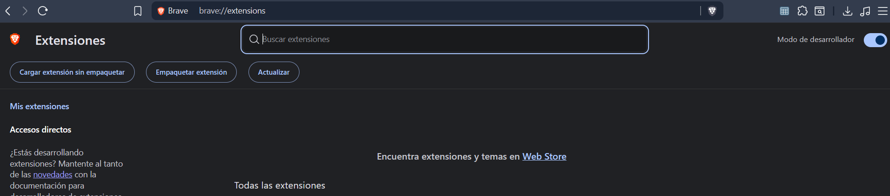
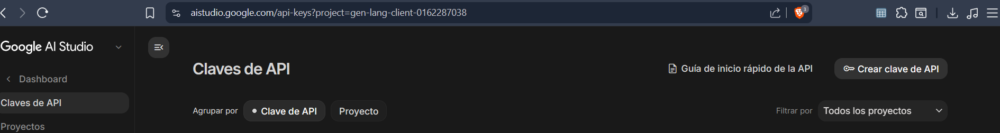
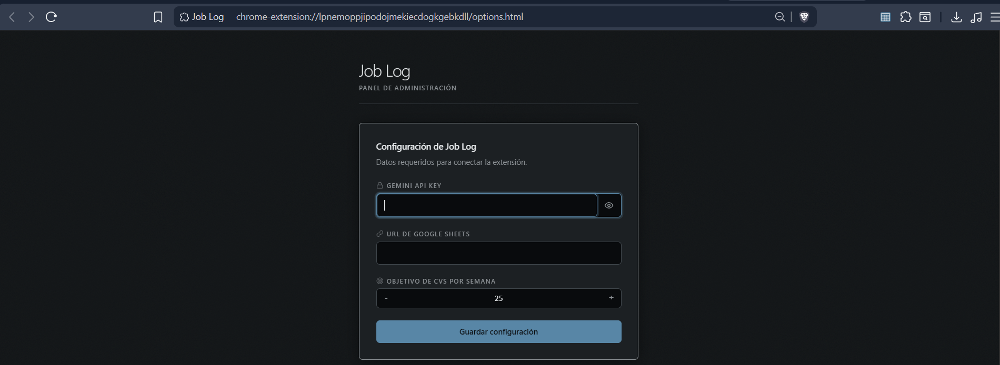
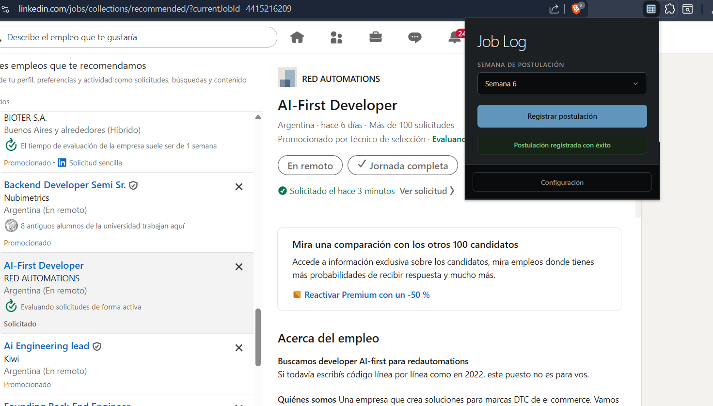

# Job Log — Extensión de Chrome para registrar tus postulaciones

**Job Log** es una extensión gratuita y de código abierto para Chrome, Brave, Edge y Opera. Registra automáticamente tus postulaciones de LinkedIn en una hoja de cálculo de Google Sheets, usando la API de Gemini para extraer la información de cada oferta.

Todo corre en tu navegador. Sin servidores. Sin intermediarios.

---

## Paso 0 — Preparar la hoja de cálculo

Antes de instalar la extensión, creá tu copia de la planilla:

1. Abrí la [plantilla de Google Sheets - Job Log](https://docs.google.com/spreadsheets/d/1pmP8vlTjwJwgYJL89mQZGuCMvN2pDb6_9oSI4HjAvPo/template/preview).
2. Hacé clic en **"Utilizar plantilla"** (esquina superior derecha). Esto crea una copia limpia y privada en tu Google Drive.
3. Copiá la **URL completa** de tu nueva planilla desde la barra de direcciones. La vas a necesitar en el Paso 2.

---

## Paso 1 — Instalar la extensión

La extensión se instala en modo desarrollador (no está en la Chrome Web Store porque es una herramienta personal y 100% auditable).

1. **Descargá el código:**
   - Con Git: `git clone https://github.com/eduardocabral8/job-log.git`
   - Sin Git: hacé clic en **Code → Download ZIP** y extraé la carpeta donde quieras.

2. **Cargala en tu navegador:**
   - Abrí la página de extensiones de tu navegador:
     - Chrome: `chrome://extensions/`
     - Brave: `brave://extensions/`
     - Edge: `edge://extensions/`
   - Activá **"Modo de desarrollador"** (arriba a la derecha).
   - Hacé clic en **"Cargar descomprimida"** y seleccioná la carpeta del proyecto (la que tiene el archivo `manifest.json`).

---

## Paso 2 — Configurar la extensión

### 2.1 — Obtener tu Gemini API Key (gratis)

La extensión necesita una API Key de Gemini para leer los datos de cada oferta:

1. Entrá a [Google AI Studio](https://aistudio.google.com/app/apikey) e iniciá sesión con tu cuenta de Google.
2. Hacé clic en **"Get API key"** → **"Create API key"** → **"Create API key in new project"**.
3. Copiá la clave generada. *No la compartas con nadie.*

### 2.2 — Cargar tus credenciales

1. Hacé clic en el ícono de la extensión en la barra de herramientas y presioná **Configuración** (o clic derecho → **Opciones**).
2. Completá los dos campos:
   - **Gemini API Key:** pegá la clave del paso anterior.
   - **URL de Google Sheets:** pegá la URL de tu planilla del Paso 0.
3. Hacé clic en **Guardar configuración**. La extensión va a validar las credenciales y queda lista.

---

## Paso 3 — Usar la extensión

1. Abrí cualquier oferta de empleo en **LinkedIn**.
2. Hacé clic en el ícono de **Job Log**.
3. La IA va a extraer automáticamente la empresa, el título del cargo, el enlace y el origen.
4. Revisá los datos, seleccioná el estado de tu postulación (*Postulado*, *En proceso*, *CV enviado*, etc.) y hacé clic en **Registrar postulación**.
5. La fila se agrega instantáneamente a tu planilla.

---

## Privacidad y seguridad

### ¿Por qué Google avisa que la extensión puede "ver y editar todas tus hojas de cálculo"?

Es una limitación de la API de Google: no existe un permiso granular para un solo archivo. El scope mínimo para poder escribir en tu planilla es `https://www.googleapis.com/auth/spreadsheets`, que aplica a todas.

Sin embargo, el acceso está limitado a nivel de código. Podés revisar el archivo [`popup.js`](./popup.js) y verificar que la extensión solo consulta el ID de la planilla que vos configuraste, y nunca toca ningún otro archivo de tu cuenta.

### Arquitectura sin servidores

La extensión corre completamente en tu navegador. El flujo de datos es directo:

**LinkedIn → API de Gemini → API de Google Sheets (tu cuenta)**

Ningún dato personal ni credencial pasa por un servidor externo.

### Código abierto

Podés auditar todo el código en los archivos principales:
- [`manifest.json`](./manifest.json) — permisos requeridos: `activeTab`, `storage`, `identity` y `scripting`.
- [`popup.js`](./popup.js) — lógica de extracción con Gemini y guardado en Sheets.
- [`options.js`](./options.js) — guardado local de credenciales en tu navegador.
